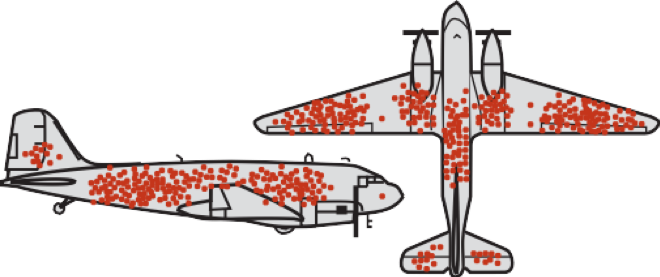
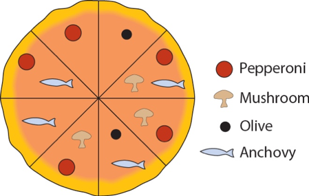

```{r setup, include=FALSE}
knitr::opts_chunk$set(echo = TRUE)
```
```{r libraries.eval,echo = FALSE,results='hide', message=F, warning=F}
# make sure you have th packages installed using 
# install.packages(packagename)

library(tidyverse)
library(Rmisc)
library(tibble)
library(dplyr)


# here i define a color palette to use as standard when plotting with ggplot
# this is purely for aesthetic reasons 

cbp2 <- c("#000000", "#E69F00", "#56B4E9", "#009E73",
          "#F0E442", "#0072B2", "#D55E00", "#CC79A7")

scale_colour_discrete <- function(...) {
  scale_colour_manual(..., values = cbp2)
}

```


## Week 1 (26.02.2020)

#### Exercise 1

The peppered moth (Biston betularia) occurs in two types: peppered (speckled black and white) and melanic (black). A researcher wished to measure the proportion of melanic individuals in the peppered moth population in England, to examine how this proportion changed from year to year in the past. To accomplish this, she photographed all the peppered moth specimens available in museums and large private collections and grouped them by the year in which they had been collected. Based on this sample, she calculated the proportion of melanic individuals in every year. The people who collected the specimens, she knew, would prefer to collect whichever type was rarest in any given year, since those would be the most valuable.

a)	Can the specimens from any given year be considered a random sample from the moth population?

b)	If not a random sample, what type of sample is it?

c)	What type of error might be introduced by the sampling method when estimating the proportion of melanic moths?

##### Solutions

a)   No. Collectors did not choose randomly, but prefered rarer types over more common ones. 

b)   It is a sample of convenience.

c)   Thus, there is bias in every year's sample because rare types are over represerented. Further this bias might change across years as the frequencies of the two morphs have changed over time.

#### Exercise 2	
Which of the following numerical variables are continuous? Which are discrete? (Note: Discrete variables are those that have a finite set of predefined values, whereas continuous variables can take any value within a given interval.)

a)	Number of injuries sustained in a fall

b)	Fraction of birds in a large sample infected with avian flu virus

c)	Number of crimes committed by a randomly sampled individual

d)	Logarithm of body mass

##### Solutions

a)   Discrete.

b)   Technically it is a discrete variable (because fractions can be enumerated / are retricted to fintely many values in a fintie sample) but it makes sense to treat it as a continous variable if the sample is very large. 

c)   Discrete. There are no half crimes.

d)   Continous. Body mass is continous and hence the log as well.

#### Exercise 3	
For each of the following studies, say which is the explanatory variable and which is the response variable. Also, say whether the study is observational or experimental.

a)	Forestry researchers wanted to compare the growth rates of trees growing at high altitude to that of trees growing at low altitude. They measured growth rates using the space between tree rings in a set of trees harvested from a natural forest. 

b)	Researchers randomly assign diabetes patients to two groups. In the first group, the patients receive a new drug, tasploglutide, whereas patients in the other group receive standard treatment without the new drug. The researchers compared the rate of insulin release in the two groups.

c)	Psychologists tested whether the frequency of illegal drug use differs between people suffering from schizophrenia and those not having the disease. They measured drug use in a group of schizophrenia patients and compared it with that in a similar sized group of randomly chosen people.

d)	Spinner Hansen et al. (2008) studied a species of spider whose females often eat males that are trying to mate with them. The researchers removed a leg from each male spider in one group (to make them weaker and more vulnerable to being eaten) and left the males in another group undamaged. They studied whether survival of males in the two groups differed during courtship.

e)	Bowen et al. (2012) studied the effects of advanced communication therapy for patients whose communication skills had been affected by previous strokes. They randomly assigned two therapies to stroke patients. One group received advanced communication therapy and the other received only social visits without formal therapy. Both groups otherwise received normal, best-practice care. After six months, the communication ability (as measured by a standardized quantitative test score) was measured on all patients.

##### Solutions 

a) E(xplanatory): Altitude (categorical: high vs low)
   R(esponse): Growth rate
   S(tudy type): Observational
   
b) E: Treatment (standard vs. tasploglutide)
   R: Rate of insulin release
   S: Experimental
   
c) E: Health status (schizophrenia vs. healthy)
   R: Frequency of illegal drug use
   S: Observational
   
d) E:Number of legs
   R: Survival propability
   S: Experimental
   
e) E: Treatment (advanced communication therapy vs. social visits without formal therapy)
   R: Communication ability
   S: Experimental

#### Exercise 4
During World War II, the British Royal Air Force estimated the density of bullet holes on different sections of planes returning to base from aerial sorties. Their goal was to use this information to determine which plane sections most needed additional protective shields. (It was not possible to reinforce the whole plane, because it would weigh too much.) They found that the density of holes was highest on the wings and lowest on the engines and near the cockpit, where the pilot sits (their initial conclusion, that therefore the wings should be reinforced, was later shown to be mistaken). What is the main problem with the sample: bias or large sampling error? What part of the plane should have been reinforced? 



##### Solution

The main problem is a strong bias in the sample. To see this, consider the sample of planes that were used in this study. Only planes that were *not* hit in critical areas were available to estimate the distribution of bullet holes. Planes that were hit in a critical area, i.e., one that leads to a crash, were not available because they did not return to base. With this knowledge, it becomes clear that it would have been better to reinforce the areas were no, or very little, bullet holes were found, namely the cockpit and engine. 


#### Exercise 5
An important quantity in conservation biology is the number of plant and animal species inhabiting a given area. To survey the community of small mammals inhabiting Kruger National Park in South Africa, a large series of live traps were placed randomly throughout the park for one week in the main dry season of 2004. Traps were set each evening and checked the following morning. Individuals caught were identified, tagged (so that new captures could be distinguished from recaptures), and released. At the end of the survey, the total number of small mammal species in the park was estimated by the total number of species captured in the survey.

a)	What is the parameter being estimated in the survey? 

b) Is the sample of individuals captured in the traps likely to be a random sample? Why or why not? In your answer, address the two criteria that define a sample as random.

c) Is the number of species in the sample likely to be an unbiased estimate of the total number of small mammal species in the park? 

##### Solution

a) The population being estimated is all the small mammals of Kruger National Park. 

b) No, the sample is not likely to be random. In a random sample, every individual has the same chance of being selected. But some small mammals might be easier to trap than others (for example, trapping only at night might miss all the mammals active only in the day time). In a random sample individuals are selected independently. Multiple animals caught in the same trap might not be independent if they are related or live near one another (this is harder to judge). 

c) The number of species in the sample might underestimate the number in the Park if sampling was not random (e.g., if daytime mammals were missed), or if rare species happened to avoid capture. Even if the sample is perfectly random, the estimator will underestimated the true number in most cases. You can sample fewer species just by chance, but not more species as there actually are. Thus -  on average – you will underestimate the true number.


## Week 2 (04.03.2020)

#### Exercise 6
We use the MPG data set introduced in the lecture.  Answer the following questions. You can use base R or ggplot if not otherwise specified.

a)	Run ggplot(data = mpg). What do you see?

b)	How many rows are in mpg? How many columns?

c)	What does the drv variable describe? Read the help for ?mpg to find out.

d)	Make a scatterplot of hwy vs cyl.

e)	What happens if you make a scatterplot of class vs drv? Why is the plot not useful?

f)	What is wrong with this code? Why are the points not blue?

```{r, echo = TRUE,results='hide', message=F, warning=F}
ggplot(data = mpg) + 
  
  geom_point(mapping = aes(x = displ, y = hwy, color = "blue"))
```

g)	Map a continuous variable to color, size, and shape. How do these aesthetics behave differently for categorical vs. continuous variables?
h)	Fix the following code:
  
```
ggplot(data = mpg) 

+ geom_point(mapping = aes(x = displ, y = hwy))
```


##### Solutions 

a)	You should see a blank plot. This is what ggplot does, it simply creates a "canvas" to which you can add "layers".

b)	How many rows are in mpg? How many columns?

```{r}
str(mpg)
```

There are 234 obsservations of  11 variables. thus, there are 11 cloumns and 234 rows. we can confirm this by looking at the dimension of the underlying data matrix:
  
  ```{r}
dim(mpg)
```


c)	

```{r}
?mpg
```
drv is a categorical vaiable indicating the drive type:
  f = front-wheel drive, r = rear wheel drive, 4 = 4wd


d)	

```{r}
ggplot(data  = mpg) + 
  geom_point(mapping = aes(y = hwy,x = cyl)) + 
  theme_classic() + 
  labs(title = "A scatterplot", y = "miles per gallon on highways",x="cylinders")
```

e)	

```{r}
ggplot(data  = mpg) + 
  geom_point(mapping = aes(x = class,y = drv)) + 
  theme_classic() + 
  labs(title = "A useless plot", x = "class",y="drive type")
```
both drv and class are categorical variable and it does not make sense to visualize them this way. What would be a better way to show these data? 


f)	Color is used wihtin the aesthetics function, where we specifiy which varibales should be used. "blue" is however not a variable in our data frame. Thus it is ignored. The follwoing code creates the correct plot:
```{r, echo = TRUE,results='hide', message=F, warning=F}
ggplot(data = mpg) + 
  geom_point(mapping = aes(x = displ, y = hwy), color = "blue")
```


g)	Map a continuous variable to color, size, and shape. How do these aesthetics behave differently for categorical vs. continuous variables?


h)	The "+" symbol always has to be in the top row:
  
``` {r}
ggplot(data = mpg) + 
  geom_point(mapping = aes(x = displ, y = hwy))
```


## Week 3 (11.03.2020)


#### Exercise 7
Load the data set "chap04e1HumanGeneLengths.csv" (the lengh of genes in the human genome, found on ilias) and answer the following questions and provide the R code you used for that. Put all of your analysis in a single R script. 

a)	How many individuals are in the sample (i.e., what is the sample size, n)?
b)	What is the sum of all of the observations? 
c)	What is the mean of this sample?  
d)	What is the sum of the squares of the measurements? 
e)	What is the variance of this sample? 
f)	What is the standard deviation of this sample? 
g)	What is the coefficient of variation for this sample? 
h)	Display the data using different plotting techniques. Which one illustrates the data best?


###### Solutions

````{r}
genes <- read.csv(url("http://www.zoology.ubc.ca/~schluter/WhitlockSchluter/wp-content/data/chapter04/chap04e1HumanGeneLengths.csv"))

# a) How many individuals are in the sample (i.e., what is the sample size, n)?

n = dim(genes)[1]
print(n)

# b)	What is the sum of all of the observations? 


sum.gene.lengths = sum(genes$geneLength)

# c)	What is the mean of this sample?  


mean.gene.length1 = sum.gene.lengths/n
mean.gene.length2 = mean(genes$geneLength)

print(mean.gene.length1)
print(mean.gene.length2)

# d)	What is the sum of the squares of the measurements? 

square.sum.gene.lengths = sum(genes$geneLength^2)
print(square.sum.gene.lengths)

# e)	What is the variance of this sample? 

# by hand:
variance.gene.length = sum((genes$geneLength - mean.gene.length1)^2)/(n-1)

print(variance.gene.length)

# for comparison:
var(genes$geneLength)

# f)	What is the standard deviation of this sample? 

sd(genes$geneLength)

# or 

sd.gene.length = sqrt(variance.gene.length)

# g)	What is the coefficient of variation for this sample? 

cv.gene.length = sd.gene.length/mean.gene.length1
print(cv.gene.length)

# h)	Display the data using different plotting techniques. Which one illustrates the data best? 

# Which one do you like best?

ggplot(data = genes) + 
  geom_histogram(mapping = aes(x = geneLength),color="black",fill="darkred") + 
  theme_classic()

ggplot(data = genes) + 
  geom_density(mapping = aes(x = geneLength),color="black",fill="darkred") + 
  theme_classic()

ggplot(data = genes) + 
  geom_boxplot(mapping = aes(y = geneLength),color="black",fill="darkred") + 
  theme_classic() + 
  coord_flip()


````

## Week 4 (18.03.2020)

#### Exercise 8
Use the stickleback dataset and calcualte the median and mean for each genotpye. Make a histogramm and add vertical lines to the histogramm indicating the mean and median for each genotype. What do you see? How does the shape of the distribution affect differences between mean and median?


##### Solutions

````{r}
# load the data file:
stickleback <- read.csv(url("http://www.zoology.ubc.ca/~schluter/WhitlockSchluter/wp-content/data/chapter03/chap03e3SticklebackPlates.csv"))

# one possible solution:

mean.mm = mean(stickleback$plates[stickleback$genotype=="mm"])
mean.mM = mean(stickleback$plates[stickleback$genotype=="Mm"])
mean.MM = mean(stickleback$plates[stickleback$genotype=="MM"])

median.mm = median(stickleback$plates[stickleback$genotype=="mm"])
median.mM = median(stickleback$plates[stickleback$genotype=="Mm"])
median.MM = median(stickleback$plates[stickleback$genotype=="MM"])

par(mfrow = c(1,3))

hist(stickleback$plates[stickleback$genotype=="MM"],
     main = "MM",xlab = "number of plates",
     col="darkred")

abline(v = mean.MM,col="black")
abline(v = median.MM,col="blue")

hist(stickleback$plates[stickleback$genotype=="Mm"],
     main = "Mm",xlab = "number of plates",
     col="darkred")
abline(v = mean.mM,col="black")
abline(v = median.mM,col="blue")

hist(stickleback$plates[stickleback$genotype=="mm"],
     main = "mm",xlab = "number of plates",
     col="darkred")
abline(v = mean.mm,col="black")
abline(v = median.mm,col="blue")


# alternatively, we can first create a data frame 
# with the means per genotype
# check out the help function of ddply
# (this is only one way to do this, you can also do it by 
# "hand" or using other functions such as tapply) :

library(dplyr)
df.mean = ddply(stickleback, "genotype", summarize, m.number = mean(plates))
df.median = ddply(stickleback, "genotype", summarize, m.number = median(plates))

# then we plot it with a single ggplot
ggplot() +
  geom_bar(data = stickleback, mapping = aes(x=plates),binwidth=5,color="black",fill="darkred") +
  geom_vline(data = df.mean, aes(xintercept=m.number),col="black",size=1) +
  geom_vline(data = df.median, aes(xintercept=m.number),col="blue",size = 1) +
  facet_wrap(~ genotype) +
  ylab("frequency") +
  theme_classic()

`````


#### Exercise 9
Write a short R script that simulates the sampling distribution of the mean. Plot the sampling distribution and add the theoretical expectation to the plot. Follow the following steps:
  
  a)	Choose a distribution that represents your population (e.g., Normal or Poisson).
b)	Draw a sample of n individuals from that population (hint: use rnorm, rpoiss, etc.. to draw a random sample), and store it in a vector.
c)	Calculate the mean of the sample. Store the mean of this sample in a vector. 
d)	Do this 1000 times, so that you have calculated a 1000 means from a 1000 samples. Hint: use a for-loop to automate this.
e)	Plot a histogram of the sample means.
f)	Add a line for the theoretical expectation of the sampling distribution. Hint: use the function dnorm to get the density of the normal distribution. 

##### Solutions

```{r}
# We choose the Poisson distribution with mean lambda = 50
lambda = 50

# We do 1000 replicates
reps = 1000

# We choose the sample size n to be 10
sample_size = 10

# the means of each sample will be stroed in this vector
means = vector("numeric",reps)

# in this loop, we will calcualte the means of the sample
for (i in 1:reps)
{
  # take a sample of the poisson distribution
  sample = rpois(sample_size,lambda)
  
  # store the mean in our vector
  means[i] = mean(sample)
}

# a histogram - note that we set freq = FALSE to 
# show realtive frequencies 
hist(means,freq=F,main="The sampling distribution of a Poisson distribution")

# we specify the x values for the theoretical poisson
x = seq(0,3*lambda,by=0.1)

#we calcualte the standard error:
SE = sqrt(lambda)/sqrt(sample_size)

# caclualte the corresponding PDF of the poisson
y = dnorm(x,lambda,SE)

lines(x,y)
```


## Week 5 (25.03.2020)

#### Exercise 10
The pizza below, ordered from the Venn Pizzeria on Bayes Street, is divided into eight slices.

 

Answer the following questions based on the drawing of the pizza:
  a)	What is the probability that a randomly drawn slice has pepperoni on it?
  
b)	What is the probability that a randomly drawn slice has both pepperoni and anchovies on it?

c)	What is the probability that a randomly drawn slice has either pepperoni  or anchovies on it?

d)	Are pepperoni and anchovies mutually exclusive on this pizza?

e)	Are olives and mushrooms mutually exclusive on this pizza?

f)	Are getting mushrooms and getting anchovies independent when randomly picking a slice of pizza?

g)	If I pick a slice from this pizza and tell you that it has olives on it, what is the chance that it also has anchovies?

h)	If I pick a slice from this pizza and tell you that it has anchovies on it, what is the chance that it also has olives?

i)	Seven of your friends each choose a slice at random and eat them without telling you what toppings they had. What is the chance that the last slice has olives on it?

j)	You choose two slices at random. What is the chance that they have both olives on them? (Be careful ??? after removing the first slice, the probability of choosing one of the remaining slices changes.)

k)	What???s the probability that a randomly chosen slice does not have pepperoni on it?
Draw a pizza for which mushrooms, olives, anchovies and pepperoni are all mutually exclusive

#### Exercise 11
After graduating from your university with a biology degree, you are interviewed for a lucrative job as a snake handler in a circus sideshow. As part of your audition, you must pick up two rattlesnakes from a pit. The pit contains eight snakes, three of which have been defanged and are assumed to be harmless, but the other five are definitely still dangerous. Unfortunately budget cuts have eliminated the herpetology course from the curriculum and so you have no way of telling in advance which snakes are dangerous and which are not. You pick one snake with your left hand and one with your right.


a)	What is the probability that you picked up no dangerous snakes?
b)	Assume that any dangerous snake that you pick up has a probability of 0.8 of biting you. The defanged snakes do not bite. What is the chance that, in picking up your two snakes, you are bitten at least once?
c)	If you picked up one snake and it didn???t bite you, what is the probability that it is defanged.

#### Exercise 12
Five different researchers independently take a random sample from the same population and calculate a 95% confidence interval for the same parameter. 
a)	What is the probability that all five researchers have calculated an interval that includes the true  value of the parameter?
b)	What is the probability that at least one does not include the true parameter value. 


## Week 6 (01.04.2020)
#### Exercise 13
Use the stickleback data set. Calculate a confidence interval for the mean plate numbers for each genotype. Make a plot that shows the mean and the confidence interval of each genotype. 

## Week 7 (08.04.2020)
## Week 8 (21.04.2020)
## Week 9 (28.04.2020)
## Week 10 (06.05.2020)
## Week 11 (13.05.2020)
## Week 12 (20.05.2020)
## Week 13 (27.05.2020)
