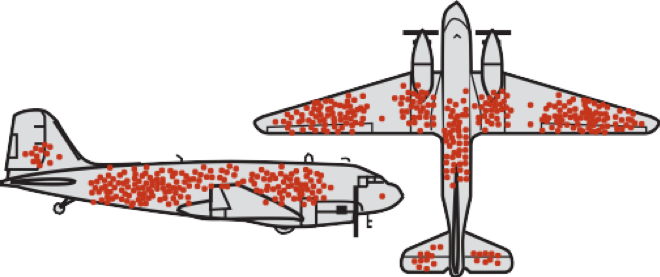

```{r setup, include=FALSE}
knitr::opts_chunk$set(echo = TRUE)
```

# Introduction

These notes should help you get started with the statistics software R, guide you through the practical part of the course and provide additional information on selected topics. Before you continue reading, make sure you have R and R Studio installed on your computer. Try to use R as an calcualtor as shown in the lecture slides and try to get yourelf acustomed to the different windows in the RStudio envrionment. No prior knwoledge about R is necessary and once everything is up and running yu can dive right in.

We start by loading some relevant packages for this course. An R package is a collection of functions, data, and documentation that extends the capabilities of base R. 

```{r libraries.eval,echo = TRUE,results='hide', message=F, warning=F}
# make sure you have th packages installed using 
# install.packages(packagename)

library(tidyverse)
library(Rmisc)
library(tibble)
library(dplyr)

cbp2 <- c("#000000", "#E69F00", "#56B4E9", "#009E73",
          "#F0E442", "#0072B2", "#D55E00", "#CC79A7")

scale_colour_discrete <- function(...) {
  scale_colour_manual(..., values = cbp2)
}

```


# Visualizations with ggplot2

We start with some examples of how to visulaize data quickly and easily. This should show you how to produce high quality visulaizations using R and motivate you to learn more about programming and data analysis with R. 

R has several systems for making graphs, and I have chosen to start with ggplot2 beacuse it is elegant, versatile and is easy to leanr if you have no prior knowledge about programming. For those of you who are already familiar wiht programming langauges, doing graphics in "base R" may seem more intuitive initially but I hope I can convince you that the grammar of plotting used by ggplot has lots of advantages and is very readable once you get the hang of it. 

If you???d like to learn more about the theoretical underpinnings of ggplot2 before you start, I???d recommend reading ???The Layered Grammar of Graphics???, http://vita.had.co.nz/papers/layered-grammar.pdf.

### The MPG dataset
Let???s use our first graph to answer a question: Do cars with big engines use more fuel than cars with small engines? What does the relationship between engine size and fuel efficiency look like? Is it positive? Negative? Linear? Nonlinear?

We can find an answer with the mpg data set found in ggplot2 (aka ggplot2::mpg). A data frame is the R data format to store data in the format of a spreadsheet: rectangular collection of variables (in the columns) and observations (in the rows). mpg contains observations collected by the US Environmental Protection Agency on 38 models of car.

```{r dataframe}
mpg
```

Among the variables in mpg are:


**displ**, a car???s engine size, in litres.

**hwy**, a car???s fuel efficiency on the highway, in miles per gallon (mpg). A car with a low fuel efficiency consumes more fuel than a car with a high fuel efficiency when they travel the same distance.


To learn more about mpg, open its help page by running ?mpg. in the next seciton we learn how to visualize such data.


### The grammar of ggplot2
In general you begin a plot with the function *ggplot()*. ggplot() creates a coordinate system that you can add layers to. The first argument of ggplot() is the dataset to use in the graph. For instance, typing ggplot(data = mpg)
into the console creates an empty graph (which is boring so it is not shown here). You can now add layers to your plot. For example, the function geom_point() adds a layer of points to your plot creating a a scatterplot.

```{r mileage}
ggplot(data = mpg) + 
  geom_point(mapping = aes(x = displ, y = hwy)) 
```

There are many other such *geometric functions* withing the ggplot2 universe and you can combine them in a single plot.  You???ll learn a whole bunch of them throughout this course, but be aware that we will only scratch the surface of what is available. After this course, you should be equipped with everthing you need to equip your self with new tools for data analysis whenever you need them.

Each geom function in ggplot2 takes a mapping argument. This defines how variables in your dataset are mapped to visual properties. The mapping argument is always paired with aes(), and the x and y arguments of aes() specify which variables to map to the x and y axes. ggplot2 looks for the mapped variables in the data argument, in this case, mpg.

Next, we use a different theme beacuse this gray background in the standard design is ugly.

```{r mileage2}
ggplot(data = mpg) + 
  geom_point(mapping = aes(x = displ, y = hwy)) +
  theme_classic()
```


The general grammar of ggplot is

ggplot(data = \<DATA\>) + 

 \<GEOM_FUNCTION\>(mapping = aes(\<MAPPINGS\>))
  
We will explain each part step by step in examples. The DATA argument should be quite clear: here you specify the dataframe (we will learn more about that alter) that you want to work with.

The second part, GEOM_FUNCTION, specifies what kind of plot you want. As mentioned above *geom_point* gives you a classic scatter plot. Many other such funtions exist and we will encounter some of them. 

Finally, MAPPING specifies which variables hould be plotted. We ussually specify this with an aesthetics mapping of the form *mapping = aes(x = ..., y =...)* to deterimne the variables that give us the x- and y-coordinates. We can however also change the aesthetics of our plot in various way, for instance by giving data points different colors that indicate the value of a third variable:  
```{r mileage_aes}
ggplot(data = mpg) + 
  geom_point(mapping = aes(x = displ, y = hwy,color = class)) +
  theme_classic()
```

Another important option is to set a clor manually:
```{r mileage_aes_2}
ggplot(data = mpg) + 
  geom_point(mapping = aes(x = displ, y = hwy), color = "blue") +
  theme_classic()
```

As a final remark, you can also create a plot, store it in a variable and then explore themes after that:

```{r mileage_aes_themes}
p = ggplot(data = mpg) + 
  geom_point(mapping = aes(x = displ, y = hwy), color = "blue") 

p+theme_classic()
p+theme_dark()
```


We now set our prefered them globally, so we do not need to specifiy it all the time:
```{r}
theme_set(theme_classic())
```

## Base R graphics

Base R refers to the standard R functions. While ggplot allows us to make sophisticated graphs very quickly, I find that in some situations base R is just as good or even better. Let us recreate the same plot as before:

```{r}
plot(mpg$displ,mpg$hwy) 
```
 
Note how we use the $ symbol to access the variables stored in a data frame here; it allows you to access a specific column of a data frame. 
Try typing the name of a dataframe, followed by the $ operator in RStudio; it should automatically suggest you the availbale variable names in your data frame.  

We can alos add stuff to this plot, change colors, and pretty much everything else we would like to. A quikc look at the help function should give you an overview about the scope of the function plot and it's parameters. For instance, have a look at the following plot, where I first make a scatterplot and modifiy the appearance of the symbols, add some labels and a title, and then add a horizontal line at the value of the median fuel efficiency:

```{r}
plot(mpg$displ,mpg$hwy,pch=16,col="darkblue",xlab="displ",ylab="hwy", main ="a scatterplot")
abline(h = median(mpg$hwy))
```

When working with data frames, ggplot may seem more attractive and easy to use than base r, simply because many steps are automated. You may want to try colro-coding the different points according to the varibale class, just as we did before. Then try to add a legend (look up the function *legend* in the R help). You will find out that it may be a bit tedious to put all this things together. However, it also gives you a lot of control about the final looks of your figure. Another advantge of base R function is that you are not restircted to the data frame format, which often makes things easier. For instance, consider this plot:

```{r}
x=seq(0,7,by=0.1)   
# x = (0,0.1,0.2,0.3, ??? ,6.9,7)
y=sin(x)


plot(x,y,lwd=2,type="l",col="deepskyblue4",axes=FALSE) 
#plot without axes

axis(1) #add axes to plot
axis(2)

text(2.8,0.85,"y = sin(x)",col="deepskyblue4")   
# add some text at coordinates x = 2.8, y = 0.85

lines(x,cos(x),lwd=2,col="green4")  # add a cosine plot ???
text(1.5,-0.5,"y=cos(x)",col="green4")   # ??? and label it

legend(3.5,0.8,legend=c("y=sin(x)","y=cos(x)"),
col=c("deepskyblue4","green4"),lwd=2)   
# add a legend to the plot
```
Instead of using a data frame, we have created vectors of variables and used them in several different ways. You will explore this more in the exercise sessions.

By now you should see that R is very versatile. This course will teach you the basics of R so that you can start using it for your research projects. An essential part is that  you should also learn how to find and use additional resources, such as the help function in R, books, the internet, etc. Nobody knows all of R - it is an ever growing community endevaour and looking up how things work, which functions or packages are available, or how other people solved a problem is an essential part of learning to be proficient in R.

# Loading datasets
How to we feed R our data? Of course, we can jsut type it into the console, a bit like in the previous base R graphics example. However, for large data sets this is not practical. We want to load our data from a file, which makes our analysis easily reproducible if we share data and the script with someone. First we need to make sure R knows where our working directory is, using the function *setwd* (set working directory):
```{r}
setwd("/Users/stephan/Dropbox/Teaching/StatisticsForBiology/")
```
If you want to check your current working directory, you can do this with *getwd()*.

I use a dataset about the number of plates on sticklebacks. You can find this dataset (and many others) on ilias. We can load a dataset using the function *read.csv* and store it in the variable stickleback
```{r}
stickleback = read.csv("chap03e3SticklebackPlates.csv")
```

The variable *stickleback* now contains a so called data frame.  We can have a quick summary of the content of this data frame using the command *str* (short for *STR*ucture):

```{r}
str(stickleback)
```

We can see form the output that we have 344 observations (= sample size) and for each individual we have measured 3 variables (id, plates and genotypes). ID and genotpye are so-called factors, that is, a catergorical variable and plates is of type integer.  

We used the function *read.csv* because our data is stored in the csv format (short for comma seperate values - open the csv file to see what that means). CSV is a common format and you can export your data from software like Excel in that format. Of course, R provides functions for other formats as well. 

Let us use our ggplot skills to create a nice figure that visualizes our data set. For this we introduce the fucntion *geom_bar()* which allows us to make a bar plot of the number of plates per indivudal, colored by genotype:
```{r}
ggplot(data = stickleback) + 
  geom_bar(mapping = aes(x = plates,color=genotype)) + 
  theme_classic()
```

This figure is a bit messy. A better way would be to show the distribution for each genotype in its own window. This can be done using the function *facet_wrap*. As before, we can simply add this to our ggplot command:

```{r}
ggplot(data = stickleback) + 
  geom_bar(mapping = aes(x = plates),fill="darkred") + 
  facet_wrap(~genotype,nrow = 3) +
  theme_classic()
```

We used a new symbol here: the ~. This is part of an R object called formula and it will alter become clear why we used it here like this. For now, just remeber to use it in front of the varibale name in facet wrap. The second aprameter is simply the number of rows in the plot. Try changing it and see what happens. Note: the variable that you pass to facet_wrap shoudl **always** be categorical!


## Manipulating data frames
A data frame is essentially a spreadsheet or a table (or rather a matrix). Therfore, we acess each column or each row, if we want to. This can be done using the *[,]* symbols. The element in row 3 and column 5 is given by:
```{r}
stickleback[3,5]
```
the whole 3rd column can be accesses by 
```{r}
stickleback[,3]
```
and the 5th row by
```{r}
stickleback[5,]
```
Note that stickleback[[,3]] gives you all measurment of the 3rd variable in our dataframe and is hence equivalent to stickleback$genotype. The vector stickleback[5,] on the other hand gives you a vector with the 3 measured values of the 5 th individual. 

We can also use this way of accessing elements to find elements of a certain type, for instance, fi we want to know the genotype of all individuals with more then 30 plates, we can get this in the following way:
```{r results = "hide"}
stickleback[stickleback$plates>20,3]
```
Try to understand what is happening here by teasing apart and investigating the differnt parts of this (nested) command. What would happen if you removed the *stickleback$plates>20* from the command, or the *3*. 

A slightly more elegant way to get this is by using the function *filter* (make sure you have the package dyplr loaded!):
```{r results = "hide"}
filter(stickleback,plates>20)
```
which gives ou a data frame with only the individuals that satisfy the condition set in the argument.

## Adding variables to data frames 

Sometimes we wish to extend our dataframe with calcualtions we did during our analysis or with additional measurements. This can be done with the function *mutate()*. It simply adds new columns at the end of your dataset. Let's say we want to identify which indivduals have fewer or more plates as comapred to the global mean:
```{r}
diff.to.mean = stickleback$plates - mean(stickleback$plates)
stickleback2 = mutate(stickleback,difference = diff.to.mean)
head(stickleback2)
```


*Questions:*

*Add a new varaible to the stickleback data frame that contains the difference between plate number and the mean plate number for that individuals genotype.

*Load the flights dataset:
```{r}
library(nycflights13)
```
Find all flights that

* Had an arrival delay of two or more hours

* Flew to Houston (IAH or HOU)

* Were operated by United, American, or Delta

* Departed in summer (July, August, and September)

* Arrived more than two hours late, but didn???t leave late

* Were delayed by at least an hour, but made up over 30 minutes in flight

* Departed between midnight and 6am 

Hint: look up logical operators!

# Calculating Descriptive Statistics 

We continue using the stickleback data set and calcualte some statistics on it. A simple way to get a quick overview about the properties of your data frame is using the funciton *summary*:

```{r}
summary(stickleback)
```

If you want to calcualte a specific statistic, like the mean of a variable, this can be done easily:

```{r}
mean(stickleback$plates)
```

You may have noticed that we have no calcualted the mean number of plates for *ALL* fish in our data set. What if we want to calcualte the number of plates for a specific genotype? We can use the function filter:

```{r}
stickleback.mm = filter(stickleback,genotype=="mm")
mean(stickleback.mm$plates)
```

You could now calcualte the mean plate numbers for each genotpye in this way: 

```{r}
mean.mm = mean((filter(stickleback,genotype=="mm"))$plates)
mean.mM = mean((filter(stickleback,genotype=="mM"))$plates)
mean.MM = mean((filter(stickleback,genotype=="MM"))$plates)
```


**Note:** The tidyverse offers  an elegant way to write a long series of commands in a very readable format. To show you how to combine multiple commands quickly, we first need two more functions,  *group_by* and *summarize*, and a new operator called the pipe: %>%  (because we create a pipeline thorugh which our data "flows"). The above code to calculate the mean for each genotype would become:
```{r}
stickleback %>% 
group_by(genotype) %>%
summarise(avg = mean(plates))
```
This is very readable: you take the dataframe stickleback, group it by genotye and summarize it by calcualting the mean number of plates. However, errors might be more difficutl to spot when the code is written in that way, as intermediate steps cannot be checked.

In the exercises you will learn a few more useful functions to rearrange, filter, extend and edit data frames.

*Question: Can you come up with anotehr way to do this whithout using filter? *

*Two possible answers (there are many ways to do this):*
Straightforward "indexing":
```{r}
mean.mm = mean(stickleback$plates[stickleback$genotype=="mm"])
mean.mM = mean(stickleback$plates[stickleback$genotype=="mM"])
mean.MM = mean(stickleback$plates[stickleback$genotype=="MM"])
```

or by using the function *tapply* (look up the help page for this function by typing "?tapply"):
```{R}
mean.plates = tapply(stickleback$plates,stickleback$genotyp,mean)
```

## Plots

We can do a boxplot easily using ggplot:
```{r}
ggplot(data = stickleback) + 
  geom_boxplot(mapping = aes(x = genotype, y = plates))
```

In base R, this can be done as well:
```{r}
boxplot(stickleback$plates[stickleback$genotype=="MM"],
        stickleback$plates[stickleback$genotype=="Mm"],
        stickleback$plates[stickleback$genotype=="mm"],
names = c("MM","Mm","mm")
)
```

*Question: Can you plot a histogram of plate numbers of individuals with genotpye mm using base R plotting functions? Hint: Use what you have learned here and look up the function hist(). Alternaticel, use ggplot and the geom_function *

*Answer:*
```{r}
hist(stickleback$plates[stickleback$genotype=="mm"],col="darkred",xlab="plates",main="Genotype: mm")

ggplot(data=filter(stickleback,genotype == "mm")) + 
  geom_histogram(mapping = aes(x = plates))
```


# A bit of workflow
In this part you will see how to explore a data set and store your analysis in a reproducible and reusable way.  

## What is an R script

So far we only used the console of R. We enter commands and R executes them. Most of the time we want to have a whole bunch of commands stored in a single space: loading the file, preparing and cleaning the data,make figures, etc. The solution is easy, we jsut store our commands in a text file with the extension *.R* and tell R do execute this script. Evene better, RStudio has its own window panel for writing and executing scripts! Try to open a new R script (via File -> New -> R script) and just write your code in the newly opened window. When you have written your code, you can eitehr execute it step by step by putting the mouse cursor in the line you want to execute and then hit then *Run* button. If you want to eecute the whole script from beginning to end, just hit the *Source* button. This allows you to make reproducible scripts than you can modify and reuse whenever you need to. This is probably the biggest advantage of R. Once you have solved a problem and wrote a script for it, you can always reuse it. The more you use R, the less work will be necessary for each new project! 


In the next part I will introduce the basic tools for creating an automated analysis that consists of several steps.

## Defining and using Variables

Defining variables is really easy in R. Unlike in other programming languages we do not need to precisly define what kind of variable we want. We can just werite down a name and assign a value, R figures out the rest. For instance:

```{r}
x = 5
```

automatically creates a *numeric* variable and assigns the value 5 to it. This command

```{r}
vec = c(1,2,3,4,5,6)
```

creates a vectors that contains the values 1 to 6. The *c* here stands for *concatenate* and tells us to combine all the numbers into a single vector. You can access the elements of the vector by their index, e.g., we can set the 5th element of the vector to 0 in the follwoing way:
```{r}
vec[5] = 0 
```

In general it is advised to define the type of a varible before using it, and also tell R how big this variable will be (that is, how much memory we need to reserve to store it). For instance, if we want to define a 3x4 matrix we can use the command *matrix*:
```{r}
mat=matrix(ncol=3,nrow=4)
```

You can then enter numbers in the rows and columns using the [] operator:

```{r}
mat
mat[2,3]= 5 
mat
```
You can see that the matrix is intially filled with the object *NA* which stands for *not available* and ist the term R uses for missing data. Just like in dataframes (after all a data frame is more or less a matrix with benefits), you can also name columns and rows and use them to access the elements:


```{r}
mat = matrix(1:25,nrow=5,ncol=5)
colnames(mat) = c("var1","var2","var3","var4","var5")
rownames(mat) = c("obs1","obs2","obs3","obs4","obs5")
mat
mat["obs2",]
mat[,"var3"]
mat["obs2","var3"]
```


If we want to store some text, we can write
```{r}
word = "hello"
```
and R will automatically recognize that the string of letters "hello" is not numeric and will creat a variable of type *character*. Try to see how this is different from 

```{r}
letters = c("h","e","l","l","o")
```

Next try to see what happens here:
```{r}
hello = 10
word1 = "hello"
word2 = hello
print(word1)
print(word2)
```


## Loops

Before we have seen how to calcualte the mean number of plates for each genotype. Essentially we have done the same thing 3 times. Imagine we woul dhave hundreeds of genotypes. In such situations loops come in handy. They allow us to automate a process that needs to be repeated many times. We only introduce the so-called *for-loop* here, which will allow you to do a lot of things. Once you have understood how it works, it will be easy to figure out how a *while-loop* works and what the differences are.

Here is a simple for loop that calcualtes the mean number of plates for each genotpye in our stickleback data set:

```{r}

# first we create a vector that contains all genotpyes in our dataset
# we can do this manually: 
# genotypes = c("mm","mM","MM")
# or by using the function levels()
# that gives us a vector with all the different entries found in a 
# vector of type factor

genotypes = levels(stickleback$genotype)

# next, we define a vector that has the same length as the number 
# of different genotypes and name the elements accordingly

plate.numbers = vector("numeric",length(genotypes)) 
names(plate.numbers)=genotypes

# no comes the actual loop:
for(g in genotypes)
{
  plate.numbers[g]=mean(stickleback$plates[stickleback$genotype==g])
}

```

We can see what is happening here by showing the intermediate steps more explicitly:

```{r}
i = 1
for(g in genotypes)
{
  print(paste("This is iteration ",i," of our for-loop"))
  print(paste("Genotype ",i," = ",g))
  mean.temp = mean(stickleback$plates[stickleback$genotype==g])
  print(paste("The mean number of plates of genotype ",g," is ",mean.temp))
  plate.numbers[g]=mean.temp
  i = i+1
}

```

There are 3 basics steps here:

* Reserve memory for the output
* Set up how often the loop should be iterated
* The code that should be repeatedly calcualted


*Question: Could you come up with an alterantive way to solve this problem using a loop?*


## If / else
Another useful tool are if/else constructs. They allow you to make choices during your script. Let us again consider the sticklbeack data set. Let say we want to calcualte the difference between the  number of plates of plates of an individual and the mean of that indivudal's genotype. We can do this by combining loops with if/else statements (admittedly, there are better ways to achieve this but it is a good instuctive example):

```{r}
number.obs = dim(stickleback)[1]
diff.to.mean = vector("numeric",length=number.obs)
for (i in 1:number.obs)
{
  if(stickleback$genotype[i] == "mm")
    diff.to.mean[i] = stickleback$plate[i] - mean.mm
  
  if(stickleback$genotype[i] == "mM")
    diff.to.mean = stickleback$plate[i] - mean.mM
  
  if(stickleback$genotype[i] == "MM")
    diff.to.mean = stickleback$plate[i] - mean.MM
}


stickleback3= mutate(stickleback2,diff.per.genotype = diff.to.mean)

head(stickleback3)
```


# Working with Distributions and random variables

## Functions to work with probaility distirbutions
R has a set of functions to work with distirbutions and random numbres. Have a look at 
```{r}
help(Distributions)
```
if you want to know more. Let us focus on the normal distirbution. It's density is given by
$$f(x|\mu,\sigma) = \frac{1}{\sigma\sqrt{2\pi}}e^{-\frac{(x-\mu)^2}{2\sigma^2}}$$
The function *dnorm* returns the value of the probability density function for the normal distribution given parameters for x, ??, and ??. Some examples of using dnorm are below:

```{r}
# We use the pdf of the normal with x = 0, 
# mu = 0 and sigma = 0. 
# The dnorm function takes three main arguments, 
# as do all of the *norm functions in R.

dnorm(0, mean = 0, sd = 1)

# Another exmaple of dnorm where parameters have been changed.

dnorm(2, mean = 5, sd = 3)
```

Let us do a  plot showing the density fucntion of the normal distirbution. We use base R as ggplot works fine with data frames and here we prefer to wrok with vectors instead. 

```{r}
# The plot should show x values on the x-axis and the dnorm(x,...) 
# values on the y-axis

# First I'll make a vector of x values
x_vals <- seq(-3, 3, by = .1)

# Let's have a look
x_vals

# The y values are then given by dnorm
y_vals <- dnorm(x_vals,0,1)

# Now we'll plot these values
plot(x_vals,y_vals, 
     type = "l", # Make it a line plot
     main = "pdf of the Standard Normal",
     xlab= "x",ylab="density") 
```

Of course, you could create a data frame with these values and then use ggplot if you want to:


```{r}
std_norm = data.frame(x= x_vals,y=y_vals)

ggplot(data = std_norm) +
  geom_line(mapping = aes(x = x,y=y))
```

The other three most relevant functions are:
*pnorm* (cumulative distribution function), *qnorm* (quantiles) and *rnorm* (draw random numbers). The ue of *pnorm* is completely analogous to *dnorm*, so we skip it here and focus on themore interesting *qnorm* and *rnorm*.

## Quantiles
The function qnorm gives us the quantiles of the normal distirbution:
```{r}
# Let's make a vector of : 
# from 0 to 1 by increments of .05
quantiles <- seq(0, 1, by = .05)
quantiles

# Now we'll find the value for each of those quantiles
# Remeber that the q-quantile is the value Q such that
# P(X>Q) = q 
# In other words, the quantile is the inverse of the CDF

qvalues <- qnorm(quantiles)
qvalues
```


## Drawing random numbers

R also allows us to draw random numbers. This is very handy in many situations. The parameters of rnorm are 
* the number of observations
* the mean of the distirbution
* the standard deviation of the distribution

Here is an example, where we calculate a sample of 0, 100 and 1000 observations of the same distirbution.
```{r}

# Let's generate three different vectors of random numbers 
# from a normal  distribution
n10 <- rnorm(10, mean = 70, sd = 5)
n100 <- rnorm(100, mean = 70, sd = 5)
n10000 <-  rnorm(10000, mean = 70, sd = 5)

# Let's just look at one of the vectors
n10


# The breaks argument specifies how many bars are in the histogram
hist(n10, breaks = 5)
hist(n100, breaks = 20)
hist(n10000, breaks = 100)
```

*Note:* If we set a *seed* for our random number generator (the algorithm that is used to calcualte a radnom number), we can make our analysis replicable:

```{r}
set.seed(100)
rnorm(1,0,1)
rnorm(1,0,1)

set.seed(100)
rnorm(1,0,1)
rnorm(1,0,1)
```


## Example: A simple simulation 
Copy and paste this R code into a script. Before you run it, try to figure out what it does.
```{r fig.show='hide'}
reps = 1000
sample_size = 10
mu = 10
sigma = 5
means = vector("numeric",reps)

for (i in 1:reps)
{
  sample = rnorm(sample_size,mu,sigma)
  means[i] = mean(sample)
}

hist(means,freq=F,main="A distribution")

x = seq(mu-2*sigma,mu+2*sigma,by=0.01)

SE = sigma/sqrt(sample_size)

y = dnorm(x,mu,SE)

lines(x,y)
```


## Plotting Confidence intervalls
We first generate a data frame with a summary of our data (this can be done in many ways, this is a concise one):

```{r}
CIs <- summarySE(stickleback, measurevar="plates", groupvars=c("genotype"))

CIs
```
and then we use the data frame with our summary to add error bars to our plot:
```{r}
ggplot(data = CIs) +
  geom_point(mapping = aes(x = genotype,y=plates)) +
  geom_errorbar(mapping = aes(x = genotype,y=plates,ymin=plates-ci, ymax=plates+ci), width=.1) 
```

*Note:* One can shorten things by specifying the aesthetics in the ggplot command - this simply means that all geom_functions use the same x and y variables (which is very often the case, but not always!):

```{r}
ggplot(data = CIs, aes(x = genotype,y=plates)) +
  geom_point() +
  geom_errorbar(mapping = aes(ymin=plates-ci, ymax=plates+ci), width=.1) 
```                        


*Note:* The function *t.test()* can also be used to calcualte confidence intervalls assuming a normal distribution.  

```{r}
genotpyes = c("MM","Mm","mm") 
CI.upper = vector("numeric",3)
CI.lower = vector("numeric",3)
means = vector("numeric",3)

i = 1

for(g in genotypes)
{
  
  results = t.test(stickleback$plates[stickleback$genotype == g])
  
  CI.lower[i] = results$conf.int[1]
  CI.upper[i]= results$conf.int[2]
  means[i] = results$estimate
  i = i + 1
}

CI.data = data.frame(genotype = genotpyes,mean = means,CI.lower = CI.lower,CI.upper = CI.upper)

ggplot(data = CI.data, aes(x = genotype,y=means)) +
  geom_point() +
  geom_errorbar(mapping = aes(ymin=CI.lower, ymax=CI.upper), width=.1) 


```


# Hypothesis Tests

In this chpater we will learn how to do hypotehsis tests in R. This is very simple, as you will see - often a single line of code is sufficient for conducting a test.

## Binomial-test
We use the binomial test to test whether spermatogenesis genes in the mouse genome occur with unusual frequency on the X chromosome. First, we load the dat set and inspect it:

```{r message = FALSE}
mouseGenes <- read_csv("~/Dropbox/Teaching/StatisticsForBiology/chap07e2SexAndX.csv")

head(mouseGenes)

# Tabulate the number of spermatogenesis genes on the 
# X-chromosome and the number not on the X-chromosome.

table(mouseGenes$onX)


# Calculate the binomial probabilities of all possible outcomes
# under the null hypothesis. Under the binomial
# distribution with n = 25 and p = 0.061, the number of successes
# can be any integer between 0 and 25.

xsuccesses <- 0:25
probx <- dbinom(xsuccesses, size = 25, prob = 0.061)
data.frame(xsuccesses, probx)

barplot(probx,names.arg=xsuccesses,xlab="# successes",ylab="probability")


# Use these probabilities to calculate the P-value corresponding to
# an observed 10 spermatogenesis genes on the X chromosome. 
# Remember to multiply the probability of 10 or more successes 
# by 2 for the two-tailed test result.

2 * sum(probx[xsuccesses >= 10])

# For a faster result, try R's built-in binomial test. 
# The resulting P-value is slightly different from our calculation. # The output of binom.test includes a confidence interval for the 
# proportion using the Clopper-Pearson method, which is more 
# conservative than the Agresti-Coull method.

binom.test(10, n = 25, p = 0.061)

# Agresti-Coull 95% confidence interval for the proportion 
# using the binom package.

library(binom)
binom.confint(30, n = 87, method = "ac")

```


## Chi-square test

We perform a goodness-of-fit test of the Poisson probability model to frequency data on number of marine invertebrate extinctions per time block in the fossil record.We first read and inspect the data. Each row is a time block, with the observed number of extinctions listed.
```{r echo = F, warning = F,message = FALSE}
extinctData <- read_csv("~/Dropbox/Teaching/StatisticsForBiology/ABD_all_data/chapter08/chap08e6MassExtinctions.csv")


```


Generate the frequency table for the number of time blocks in each number-of-extinctions category. Notice that a simple table does what's needed, but some extinction categories are not represented (e.g., 0, 12 and 13 extinctions).

```{r}
extinctTable <- table(extinctData$numberOfExtinctions)
data.frame(Frequency = addmargins(extinctTable))
```

To remedy the problem of missing categories, save the original variable as a factor that has all counts between 0 and 20 as levels (note that 20 is not the maximum possible number of extinctions, but it is a convenient cutoff for this table).

```{r}
extinctData$nExtinctFactor = factor(extinctData$numberOfExtinctions, levels = c(0:20))
extinctTable2 <- table(extinctData$nExtinctFactor)
data.frame(Frequency = addmargins(extinctTable2))
```

Estimate the mean number of extinctions per time block from the data. The estimate is needed for the goodness-of-fit test.

```{r}
meanExtinctions <- mean(extinctData$numberOfExtinctions)
meanExtinctions
```

Calculate expected frequencies under the Poisson distribution using the estimated mean. (For now, continue to use 20 extinctions as the cutoff, but don't forget that the Poisson distribution includes the number-of-extinctions categories 21, 22, 23, and so on.)

```{r}
expectedProportion <- dpois(0:20, lambda = meanExtinctions)
expectedFrequency <- expectedProportion * 76
```

Show the frequency distribution in a histogram.

```{r}
hist(extinctData$numberOfExtinctions, right = FALSE, breaks = seq(0, 21, 1),
	xlab = "Number of extinctions")

```


Make a table of observed and expected frequencies, saving as a data frame.

``` {r}
extinctFreq <- data.frame(nExtinct = 0:20, obsFreq = as.vector(extinctTable2), 
	expFreq = expectedFrequency)
extinctFreq
```


The low expected frequencies will violate the assumptions of the ??2 test, so we will need to group categories. Create a new variable that groups the extinctions into fewer categories.

```{r}
extinctFreq$groups <- cut(extinctFreq$nExtinct, 
	breaks = c(0, 2:8, 21), right = FALSE,
	labels = c("0 or 1","2","3","4","5","6","7","8 or more"))
extinctFreq
```

Then sum up the observed and expected frequencies within the new categories.

``` {r}
obsFreqGroup <- tapply(extinctFreq$obsFreq, extinctFreq$groups, sum)
expFreqGroup <- tapply(extinctFreq$expFreq, extinctFreq$groups, sum)
data.frame(obs = obsFreqGroup, exp = expFreqGroup)
```

The expected frequency for the last category, "8 or more", doesn't yet include the expected frequencies for the categories 21, 22, 23, and so on. However, the expected frequencies must sum to 76. In the following, we recalculate the expected frequency for the last group, expFreqGroup[length(expFreqGroup)], as 76 minus the sum of the expected frequencies for all the other groups.

```{r}
expFreqGroup[length(expFreqGroup)] = 76 - sum(expFreqGroup[1:(length(expFreqGroup)-1)])
data.frame(obs = obsFreqGroup, exp = expFreqGroup)
```

Finally, we are ready to carry out the ??2 goodness-of-fit test. R gives us a warning here because one of the expected frequencies is less than 5. However, we have been careful to meet the assumptions of the ??2 test, so let's persevere. Once again, R doesn't know that we've estimated a parameter from the data (the mean), so it won't use the correct degrees of freedom when calculating the P-value. As before, we need to grab the ??2 value calculated by chisq.test and recalculate P using the correct degrees of freedom. Since the number of categories is now 8, the correct degrees of freedom is 8 - 1 - 1 = 6.

```{r}
saveChiTest <- chisq.test(obsFreqGroup, p = expFreqGroup/76)
saveChiTest # Wrong degrees of freedom, so wrong P-value!
pValue <- 1 - pchisq(saveChiTest$statistic, df = 6)
unname(pValue) # correct P-value!
```

## t-test

### One-sample t-test
We use a one-sample t-test to compare body temperature in a random sample of people with the "expected" temperature 98.6 ??F.

Read and inspect the data:

````{r}
heat <- read.csv(url("http://www.zoology.ubc.ca/~schluter/WhitlockSchluter/wp-content/data/chapter11/chap11e3Temperature.csv"))
head(heat)


hist(heat$temperature, right = FALSE, breaks = seq(97, 100.5, by = 0.5),
	col = "firebrick", las = 1, xlab = "Body temperature (degrees F)", 
	ylab = "Frequency", main = "")

```

One-sample t-test can be calculate using the fucntion t.test. The mu argument gives the value stated in the null hypothesis.

```{r}
t.test(heat$temperature, mu = 98.6)
```


### Two-sample t-test

WE calcaulte a confidence interval for the difference between two means, and the two-sample t-test, comparing horn length of live and dead (spiked) horned lizards.

```{r}
lizard <- read.csv(url("http://www.zoology.ubc.ca/~schluter/WhitlockSchluter/wp-content/data/chapter12/chap12e3HornedLizards.csv"))
head(lizard)
```

Note that there is one missing value for the variable "squamosalHornLength". Everything is easier if we eliminate the row with missing data.

```{r}
lizard2 <- na.omit(lizard)
head(lizard2)

ggplot(data = lizard2) +
  geom_histogram(mapping = aes(x = squamosalHornLength )) + 
  facet_wrap( ~Survival,nrow=2) + 
  theme_classic() 


```


A two-sample t-test of the difference between two means can be carried out with t.test by using a formula, asking if squamosalHornLength is predicted by Survival, and specifying that the variables are in the data frame lizard.

```{r}
t.test(squamosalHornLength ~ Survival, data = lizard)
```

The same reuslt could be achieved with 
```{r}
t.test(lizard$squamosalHornLength[lizard$Survival=="killed"], lizard$squamosalHornLength[lizard$Survival=="living"])
```


The output of t.test includes the 95% confidence interval for the difference between means. Add $confint after calling the function to get R to report only the confidence interval. The formula in the following command tells R to compare squamosalHornLength between the two groups indicated by Survival.

```{r}
t.test(squamosalHornLength ~ Survival, data = lizard)$conf.int
```

*Note: R has used the Welch two sample t-test here. If we want to force R to use the standrad t.test we set a parameter specifiying this:

```{r}
t.test(squamosalHornLength ~ Survival, data = lizard,var.equal = TRUE)
```


# Deviations from Normailty

## QQ Plots and Transformations
We investigate the ratio of biomass between marine reserves and non-reserve control areas.

```{r}
marine <- read.csv(url("http://www.zoology.ubc.ca/~schluter/WhitlockSchluter/wp-content/data/chapter13/chap13e1MarineReserve.csv"))
head(marine)

ggplot(data = marine) +
  geom_histogram(mapping = aes(x = biomassRatio))

```
Normal quantile plot of biomass ratio data.

```{r}
library(car)
qqPlot(marine$biomassRatio, distribution = "norm")
```


The function log() takes the natural logarithm of all the elements of a vector or variable. The following command puts the results into a new variable in the same data frame, marine.

```{r}
marine = mutate(marine,logBiomassRatio =  log(biomassRatio))
```

Histogram and QQ-Plot of the log-transformed marine biomass ratio.

```{r}
ggplot(data = marine) +
  geom_histogram(mapping = aes(x = logBiomassRatio))

qqPlot(marine$logBiomassRatio, distribution = "norm")
```


95% confidence interval of the mean using the log-transformed data.

```{r}
t.test(marine$logBiomassRatio)$conf.int
```
Back-transform lower and upper limits of confidence interval (exp is the inverse of the log function).

```{r}
exp(t.test(marine$logBiomassRatio)$conf.int )
```


## Non-Parametric Alterantives

The Wilcoxon rank-sum test (equivalent to the Mann-Whitney U-test) comparing times to mating (in hours) of starved and fed female sagebrush crickets. We also apply the permutation test to the same data.

Read and inspect data.
```{r}
cannibalism <- read.csv(url("http://www.zoology.ubc.ca/~schluter/WhitlockSchluter/wp-content/data/chapter13/chap13e5SagebrushCrickets.csv"))
head(cannibalism)

```


```{r}
ggplot(data = cannibalism) +
  geom_histogram(mapping = aes(x = timeToMating ),bins=12) + 
  facet_wrap( ~feedingStatus,nrow=2) + 
  theme_classic() 
```


Wilcoxon rank-sum test (equivalent to Mann-Whitney U-test)

```{r}
wilcox.test(timeToMating ~ feedingStatus, data = cannibalism)
```
## Permutation Test

Permutation test of the difference between mean time to mating of starved and fed crickets. Begin by calculating the observed difference between means (starved minus fed). The difference is -18.25734 in this data set.

```{r}

# tapply is another way to calcualte the means of time to mating
# for each feeding status seperatly

cricketMeans <- tapply(cannibalism$timeToMating, cannibalism$feedingStatus, mean)

cricketMeans
diffMeans <- cricketMeans[2] - cricketMeans[1]
diffMeans
```

Decide on the number of permutations.

```{r}
nPerm <- 10000
```
Create a loop to permute the data many times (determined by nperm). In the loop, i is just a counter that goes from 1 to nPerm by 1; each permuted difference is saved in the permResult.

```{r}
permResult <- vector() # initializes
for(i in 1:nPerm){
	# step 1: permute the times to mating
	permSample <- sample(cannibalism$timeToMating, replace = FALSE)
	# step 2: calculate difference betweeen means
	permMeans <- tapply(permSample, cannibalism$feedingStatus, mean)
	permResult[i] <- permMeans[2] - permMeans[1]
}

```

Plot null distribution based on the permuted differences.

```{r}
hist(permResult, right = FALSE, breaks = 100)
```

Use the null distribution to calculate an approximate P-value. This is the twice the proportion of the permuted means that fall below the observed difference in means, diffMeans (-18.25734 in this example). The following code calculates the number of permuted means falling below diffMeans.

```{r}
sum(as.numeric(permResult <= diffMeans))
```

These commands obtain the fraction of permuted means falling below diffMeans.

```{r}
sum(as.numeric(permResult <= diffMeans)) / nPerm
```

Finally, multiply by 2 to get the P-value for a two-sided test.
```{r}
2 * ( sum(as.numeric(permResult <= diffMeans)) / nPerm )
```


# ANOVA
## One way ANOVA

Analysis of variance, comparing phase shift in the circadian rhythm of melatonin production in participants given alternative light treatments. Also, the nonparametric Kruskal-Wallis test. Finally, we use the same data to demonstrate planned comparisons and unplanned comparisons (Tukey-Kramer tests).

Read and inspect the data.

```{r}
circadian <- read.csv(url("http://www.zoology.ubc.ca/~schluter/WhitlockSchluter/wp-content/data/chapter15/chap15e1KneesWhoSayNight.csv"))
```

Set the preferred ordering of groups in tables and graphs.

```{r}
circadian$treatment <- factor(circadian$treatment, 
	levels = c("control", "knee", "eyes")) 


meanShift <- tapply(circadian$shift, circadian$treatment, mean)
sdevShift <- tapply(circadian$shift, circadian$treatment, sd)
n         <- tapply(circadian$shift, circadian$treatment, length)
mean_SD =data.frame(mean = meanShift, std.dev = sdevShift, n = n,treatment = c("control", "knee", "eyes"))

```

Strip chart of circadian rhythm shift by treatment.


Add standard error bars to previous strip chart. This makes use of the descriptive statistics calculated in an earlier step. The error bars are added as line segments, offset along the x-axis by the amount adjustAmount. The means are added using points.

```{r}

ggplot(data = circadian) +
  geom_jitter(mapping = aes(x = treatment,y=shift),width=0.1) + 
  geom_errorbar(data = mean_SD,mapping = aes(x = treatment,ymin=meanShift-sdevShift/sqrt(n), ymax=meanShift+sdevShift/sqrt(n)), width=.1,color="red") + 
  geom_point(data = mean_SD,mapping = aes(x = treatment,y=meanShift),color="red")


```


Fixed effects ANOVA table (Table 15.1-2). This is done in two steps. The first step involves fitting the ANOVA model to the data using lm ("lm" stands for "linear model", of which ANOVA is one type). Then we use the command anova to assemble the ANOVA table.

```{r}
circadianAnova <- lm(shift ~ treatment, data = circadian)
anova(circadianAnova)
```

R2 indicating the fraction of variation in the response variable "explained" by treatment. This is again done in two steps. The first step calculates a bunch of useful quantities from the ANOVA model object previously created with a lm command. The second step shows the R2 value.

```{r}
circadianAnovaSummary <- summary(circadianAnova)
circadianAnovaSummary$r.squared
```

## Two way ANOVA
Analyze data from a factorial experiment investigating the effects of herbivore presence, height above low tide, and the interaction between these factors, on abundance of a red intertidal alga using two-factor ANOVA.

Read and inspect the data.

```{r}
algae <- read.csv(url("http://www.zoology.ubc.ca/~schluter/WhitlockSchluter/wp-content/data/chapter18/chap18e3IntertidalAlgae.csv"))
head(algae)
```

We first take a look at the data:
```{r}
ggplot(data = algae,  aes(x = height, color = herbivores, group = herbivores, y = sqrtArea)) +
  geom_point()
```

This is  a mess so we next add some summary statistics of the data: the mean Area for each combination of explanatory variables.
```{r}
ggplot(data = algae) +
  aes(x = height, color = herbivores, group = herbivores, y = sqrtArea) +
    geom_point()+
  stat_summary(fun.y = mean, geom = "point") +
  stat_summary(fun.y = mean, geom = "line")+ 
  labs(title="Hopp YB! ;-)",
        x ="height", y = "Aread")
```

It looks like there is some interaction between *height* and *herbivores*, but there is also quite some noise so it is difficult to tell.

Let us first fit a null model having both main effects but no interaction term. We can do this again with *lm* (*note:* conceptually a t-test, an ANOVA and linear regression are all pretty much the same thing and hence the function lm can be used in all these cases):

```{r}
algaeNoInteractModel <- lm(sqrtArea ~ height + herbivores, data = algae)

summary(algaeNoInteractModel)
```

Now fit the full model, with interaction term included.
```{r}
algaeFullModel <- lm(sqrtArea ~ height * herbivores, data = algae)
```

Finally we cretea na ANOVA table that compares the two models:
```{r}
anova(algaeNoInteractModel, algaeFullModel)
```


# Linear Regression

 Test the null hypothesis of zero regression slope. The data are from an experiment investigating the effect of plant species diversity on the stability of plant biomass production.

Read and inspect the data.
```{r}
prairie <- read.csv(url("http://www.zoology.ubc.ca/~schluter/WhitlockSchluter/wp-content/data/chapter17/chap17e3PlantDiversityAndStability.csv"))
head(prairie)
```

Log-transform stability and include the new variable in the data frame. Inspect the data frame once again to make sure the function worked as intended.

```{r}
prairie = mutate(prairie,logStability = log(biomassStability))
head(prairie)
```
Scatter plot with regression line in base R:
```{r}
plot(logStability ~ nSpecies, data = prairie) 
prairieRegression <- lm(logStability ~ nSpecies, data = prairie)
abline(prairieRegression)
```

Scatter plot with regression line in ggplot:
```{r}
ggplot(data = prairie,aes(y=logStability,x=nSpecies)) +
  geom_point()+
  geom_smooth(method = "lm")

```


```{r}
prairieRegression <- lm(logStability ~ nSpecies, data = prairie)
summary(prairieRegression)
confint(prairieRegression)
```


# Exercises

## Week 1 (26.02.2020)

#### Exercise 1

The peppered moth (Biston betularia) occurs in two types: peppered (speckled black and white) and melanic (black). A researcher wished to measure the proportion of melanic individuals in the peppered moth population in England, to examine how this proportion changed from year to year in the past. To accomplish this, she photographed all the peppered moth specimens available in museums and large private collections and grouped them by the year in which they had been collected. Based on this sample, she calculated the proportion of melanic individuals in every year. The people who collected the specimens, she knew, would prefer to collect whichever type was rarest in any given year, since those would be the most valuable.

 a)	Can the specimens from any given year be considered a random sample from the moth population?

 b)	If not a random sample, what type of sample is it?

 c)	What type of error might be introduced by the sampling method when estimating the proportion of melanic moths?

#### Exercise 2	
Which of the following numerical variables are continuous? Which are discrete? (Note: Discrete variables are those that have a finite set of predefined values, whereas continuous variables can take any value within a given interval.)
 a)	Number of injuries sustained in a fall
 b)	Fraction of birds in a large sample infected with avian flu virus
 c)	Number of crimes committed by a randomly sampled individual
 d)	Logarithm of body mass

#### Exercise 3	
For each of the following studies, say which is the explanatory variable and which is the response variable. Also, say whether the study is observational or experimental.
 a)	Forestry researchers wanted to compare the growth rates of trees growing at high altitude to that of trees growing at low altitude. They measured growth rates using the space between tree rings in a set of trees harvested from a natural forest. 
 b)	Researchers randomly assign diabetes patients to two groups. In the first group, the patients receive a new drug, tasploglutide, whereas patients in the other group receive standard treatment without the new drug. The researchers compared the rate of insulin release in the two groups.
 c)	Psychologists tested whether the frequency of illegal drug use differs between people suffering from schizophrenia and those not having the disease. They measured drug use in a group of schizophrenia patients and compared it with that in a similar sized group of randomly chosen people.
 d)	Spinner Hansen et al. (2008) studied a species of spider whose females often eat males that are trying to mate with them. The researchers removed a leg from each male spider in one group (to make them weaker and more vulnerable to being eaten) and left the males in another group undamaged. They studied whether survival of males in the two groups differed during courtship.
 e)	Bowen et al. (2012) studied the effects of advanced communication therapy for patients whose communication skills had been affected by previous strokes. They randomly assigned two therapies to stroke patients. One group received advanced communication therapy and the other received only social visits without formal therapy. Both groups otherwise received normal, best-practice care. After six months, the communication ability (as measured by a standardized quantitative test score) was measured on all patients.

#### Exercise 4
During World War II, the British Royal Air Force estimated the density of bullet holes on different sections of planes returning to base from aerial sorties. Their goal was to use this information to determine which plane sections most needed additional protective shields. (It was not possible to reinforce the whole plane, because it would weigh too much.) They found that the density of holes was highest on the wings and lowest on the engines and near the cockpit, where the pilot sits (their initial conclusion, that therefore the wings should be reinforced, was later shown to be mistaken). What is the main problem with the sample: bias or large sampling error? What part of the plane should have been reinforced? 



#### Exercise 5
An important quantity in conservation biology is the number of plant and animal species inhabiting a given area. To survey the community of small mammals inhabiting Kruger National Park in South Africa, a large series of live traps were placed randomly throughout the park for one week in the main dry season of 2004. Traps were set each evening and checked the following morning. Individuals caught were identified, tagged (so that new captures could be distinguished from recaptures), and released. At the end of the survey, the total number of small mammal species in the park was estimated by the total number of species captured in the survey. 
 a)	What is the parameter being estimated in the survey? 
 b) Is the sample of individuals captured in the traps likely to be a random sample? Why or why not? In your answer, address the two criteria that define a sample as random.
 c) Is the number of species in the sample likely to be an unbiased estimate of the total number of small mammal species in the park? 


## Week 2 (04.03.2020)

#### Exercise 6
We use the MPG data set introduced in the lecture.  Answer the following questions. You can use base R or ggplot if not otherwise specified.

 a)	Run ggplot(data = mpg). What do you see?

 b)	How many rows are in mpg? How many columns?

 c)	What does the drv variable describe? Read the help for ?mpg to find out.

 d)	Make a scatterplot of hwy vs cyl.

 e)	What happens if you make a scatterplot of class vs drv? Why is the plot not useful?

 f)	What???s gone wrong with this code? Why are the points not blue?

ggplot(data = mpg) + 

  geom_point(mapping = aes(x = displ, y = hwy, color = "blue"))

 g)	Map a continuous variable to color, size, and shape. How do these aesthetics behave differently for categorical vs. continuous variables?
 h)	Fix the following code:

ggplot(data = mpg) 

+ geom_point(mapping = aes(x = displ, y = hwy))


## Week 3 (11.03.2020)


#### Exercise 7
Load the data set XXX (found on ilias) and answer the following questions and provide the R code you used for that. Put all of your analysis in a single R script. 

 a)	How many individuals are in the sample (i.e., what is the sample size, n)? 
 b)	What is the sum of all of the observations? 
 c)	What is the mean of this sample? Here and forever after, provide units with your answer. 
 d)	What is the sum of the squares of the measurements? 
 e)	What is the variance of this sample? 
 f)	What is the standard deviation of this sample? 
 g)	What is the coefficient of variation for this  sample? 
 h)	Display the data using different plotting techniques. Which one illustrates the data best?


## Week 4 (18.03.2020)

#### Exercise 8
Write a short R script that simulates the sampling distribution of the mean. Plot the sampling distribution and add the theoretical expectation to the plot. Follow the following steps:

 a)	Choose a distribution that represents your population.
 b)	Draw a sample of n individuals from that population (hint: use rnorm, rbinom, etc.. to draw a random sample), and store it in a vector.
 c)	Calculate the mean of the sample. Store the mean in a vector. 
 d)	Do this 1000 times, so that you have calculated a 1000 means from a 1000 samples. Hint: use a for-loop to automate this
 e)	Plot a histogram of the sample means.
 f)	Add a line for the theoretical expectation of the sampling distribution. Hint: use the function dnorm to get the density of the normal distribution. 


## Week 5 (25.03.2020)

#### Exercise 9
The pizza below, ordered from the Venn Pizzeria on Bayes Street,
 is divided into eight slices.

 

Answer the following questions based on the drawing of the pizza:
 a)	What is the probability that a randomly drawn slice has pepperoni on it?
 b)	What is the probability that a randomly drawn slice has both pepperoni and anchovies on it?
 c)	What is the probability that a randomly drawn slice has either pepperoni  or anchovies on it?
 d)	Are pepperoni and anchovies mutually exclusive on this pizza?
 e)	Are olives and mushrooms mutually exclusive on this pizza?
 f)	Are getting mushrooms and getting anchovies independent when randomly picking a slice of pizza?
 g)	If I pick a slice from this pizza and tell you that it has olives on it, what is the chance that it also has anchovies?
 h)	If I pick a slice from this pizza and tell you that it has anchovies on it, what is the chance that it also has olives?
 i)	Seven of your friends each choose a slice at random and eat them without telling you what toppings they had. What is the chance that the last slice has olives on it?
 j)	You choose two slices at random. What is the chance that they have both olives on them? (Be careful ??? after removing the first slice, the probability of choosing one of the remaining slices changes.)
 k)	What???s the probability that a randomly chosen slice does not have pepperoni on it?
Draw a pizza for which mushrooms, olives, anchovies and pepperoni are all mutually exclusive

#### Exercise 10
After graduating from your university with a biology degree, you are interviewed for a lucrative job as a snake handler in a circus sideshow. As part of your audition, you must pick up two rattlesnakes from a pit. The pit contains eight snakes, three of 
which have been defanged and are assumed to be harmless, but the other five are definitely still dangerous. Unfortunately budget cuts have eliminated the herpetology course from the curriculum and so you have no way of telling in advance which snakes are dangerous and which are not. You pick one snake with your left hand and one with your right.


 a)	What is the probability that you picked up no dangerous snakes?
 b)	Assume that any dangerous snake that you pick up has a probability of 0.8 of biting you. The defanged snakes do not bite. What is the chance that, in picking up your two snakes, you are bitten at least once?
 c)	If you picked up one snake and it didn???t bite you, what is the probability that it is defanged.

#### Exercise 11
Five different researchers independently take a random sample from the same population and calculate a 95% confidence interval for the same parameter. 
 a)	What is the probability that all five researchers have calculated an interval that includes the true  value of the parameter?
 b)	What is the probability that at least one does not include the true parameter value. 

#### Exercise 12
Load the data set XXX. Calculate a confidence interval for the mean of the data. Make a plot that shows the mean and the confidence interval. 

## Week 6 (01.04.2020)
## Week 7 (08.04.2020)
## Week 8 (21.04.2020)
## Week 9 (28.04.2020)
## Week 10 (06.05.2020)
## Week 11 (13.05.2020)
## Week 12 (20.05.2020)
## Week 13 (27.05.2020)